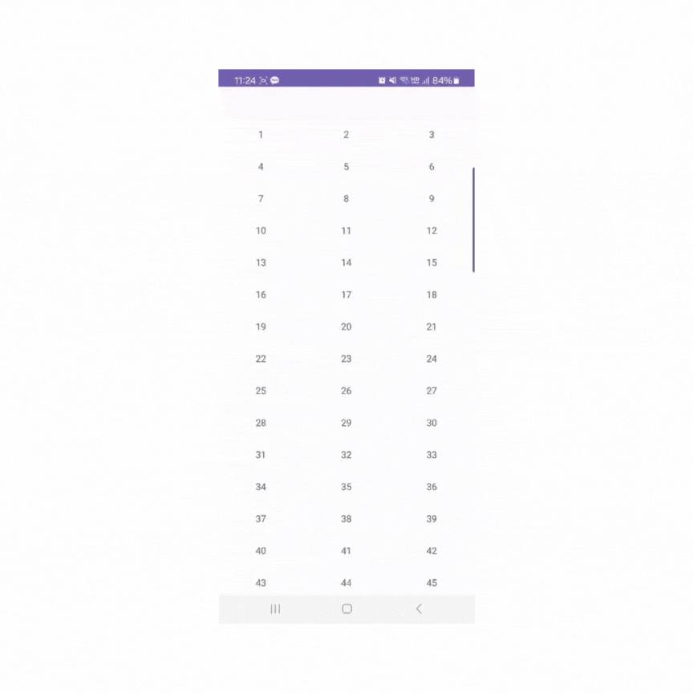

# RecyclerView 학습하기

### 뷰 홀더 재사용과 상태 관리의 중요성

RecyclerView의 핵심 기능 중 하나는 뷰 홀더의 재사용이다.  
아이템 상태를 올바르게 관리하지 않으면 예기치 않은 UI 동작을 초래할 수 있다.

 

예를 들어, 아이템을 선택하여 그 배경색을 변경하는 경우  
그 아이템이 스크롤로 인해 화면 밖으로 이동하고 나중에 다시 화면에 나타날 때,  
해당 선택 상태가 유지되지 않을 수 있다.

 

RvAdapter에서 selectedPosition이라는 변수를 사용해서 현재 선택된 아이템의 위치를 추적한다.  
아이템 클릭 이벤트가 발생할 때, selectedPosition의 값을 업데이트하고, 변경된 상태를 반영하기위해  
notifyItemChanged를 호출하여 해당 아이템 뷰를 업데이트 한다.

 

### ListAdapter

ListAdapter는 RecyclerView.Adapter의 확장된 형태로, AsyncListDiffr를 내부적으로 사용한다.  
즉, DiffUtil을 활용하여 데이터 세트의 변경 사항을 효율적으로 계산한다.  
DiffUtil은 작업을 백그라운드 스레드에서 수행하므로 UI스레드(메인스레드)의 블로킹을 방지한다.

 

### View Binding

View Binding은 findViewById의 사용을 줄이고, 널 포인터 예외 및 유효하지 않은 ID로 인한 오류를  
컴파일 타임에서 잡을 수 있다.

 

### 익명 클래스를 통한 인터페이스 구현

RvAdapter에 인터페이스를 직접 상속받아 구현하는 방식 대신  
익명 클래스를 사용하여 인터페이스를 구현하였다.  
이것은 결합도를 낮추고 재사용성과 유지보수성을 향상시킨다.

